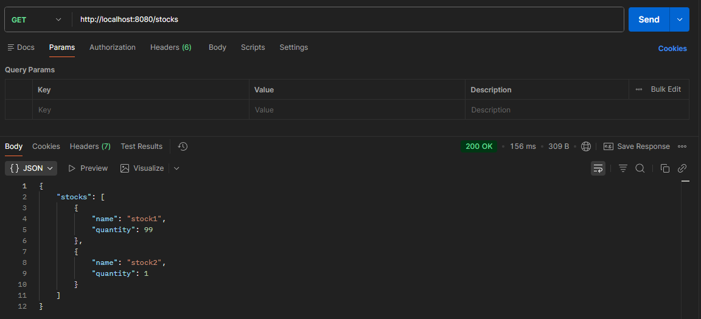
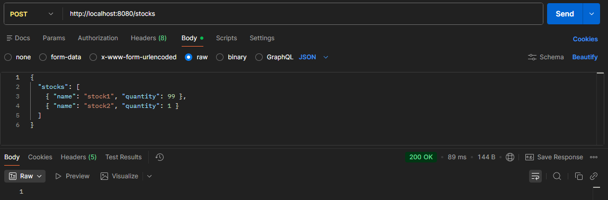
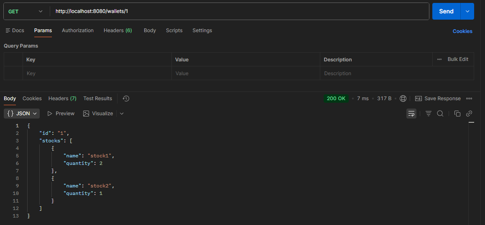

# Simplified Stock Market

A high-availability, simplified stock market REST API. This service manages bank, user wallets, and processes buy/sell transactions with audit log.

## Architecture and High Availability

To meet the non-functional requirements and ensure High Availability, this solution is built with a following architecture:
* **Load Balancing** - An `nginx` reverse proxy acts as the entry point, distributing incoming traffic across multiple API instances.
* **Replication** - This application runs with `2 replicas`.
* **Shared Persistence (SQLite)** - Even though SQLite is a file-based database, High Availability is achieved by using a **Docker Shared Volume**. Both API replicas mount the same storage, ensuring that data written by one instance is immediately available to the other.
* **Resilience** - If one instance is killed (e.g. via the `/chaos` endpoint), Nginx automatically reroutes all traffic to the healthy replica.

## Prerequisites
* [Docker](https://www.docker.com/)
* [Docker Compose](https://docs.docker.com/compose/)

## Getting Started

The application can be started using a single command, running across all major operating systems (Windows/Linux/macOS) and architectures (x64/ARM64).

You can specify the port (XXXX) by passing the `PORT` environment variable to the startup command.

**Start the application on port 8080 (default) or any custom port:**
* For Linux/macOS:
  ```bash
  PORT=8080 docker compose up --build -d
  ```
  
* For Windows (PowerShell):
  ```bash
  $env:PORT=8080; docker compose up --build -d
  ```

The API will be available at `http://localhost:8080`

**To shut down and clean up resources:**
```bash
docker compose down -v
```

## API Endpoints

### Bank Operations
* `POST /stocks` - Initialize the bank's stock inventory.
  * Body: `{ "stocks": [ { "name": "stock1", "quantity": 99 }, { "name": "stock2", "quantity": 1 } ] }`
* `GET /stocks` - Retrieve the current inventory of the bank.

### Wallet Operations
* `POST /wallets/{wallet_id}/stocks/{stock_name}` - Buy or sell a stock.
  * Body: `{ "type": "buy" }` or `{ "type": "sell" }`
* `GET /wallets/{wallet_id}` - Get the current state of a specific wallet
* `GET /wallets/{wallet_id}/stocks/{stock_name}` - get the quantity of a specific stock in a wallet

### System and Audit
* `GET /log` - retrieve the audit log of all successful wallet operations.
* `POST /chaos` - kills the instance serving the request

## Tech Stack

* **Framework** - Node.js / NestJS (TypeScript)
* **Database** - SQLite
* **ORM** - Prisma
* **Infrastructure** - Docker, Docker Compose, Nginx

## Photos

Below are photos showing testing API using Postman
<div align="center">
    
    
    
</div>